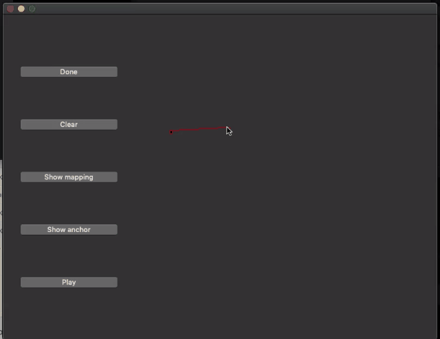

# 2D Shape Blending

Implementation of paper:  [A Fuzzy Approach to Digital Image Warping](https://ieeexplore.ieee.org/stamp/stamp.jsp?arnumber=511850&tag=1)


###  Compile:

​	MacOS:

 1. Install Qt and Eigen3

    ```shell
    brew install qt
    brew install eigen
    ```

 2. Generate .pro file

    ```
    qmake -project QT+=widgets
    ```

	3. Edit .pro file, add the header files location of Eigen to INCLUDEPATH, use *brew info eigen* to see where eigen is. Note: there is a space between '.' and eigen header files' path:

    ```
    INCLUDEPATH += . /usr/local/Cellar/eigen/3.3.5/include/eigen3
    ```

	4. Generate makefile:

    ```
    qmake
    ```

	5. Compile:

    ```
    make
    ```


Demo:




Note:

1. Number of source polygon's vertices should >= Number of target polygon's vertices
2. You may get wrong points mapping if you draw 2 polygons in the opposite direction. e.g. draw the source polygon clockwise and the target polygon anti-clockwise.
3. The program may crash every now and then.